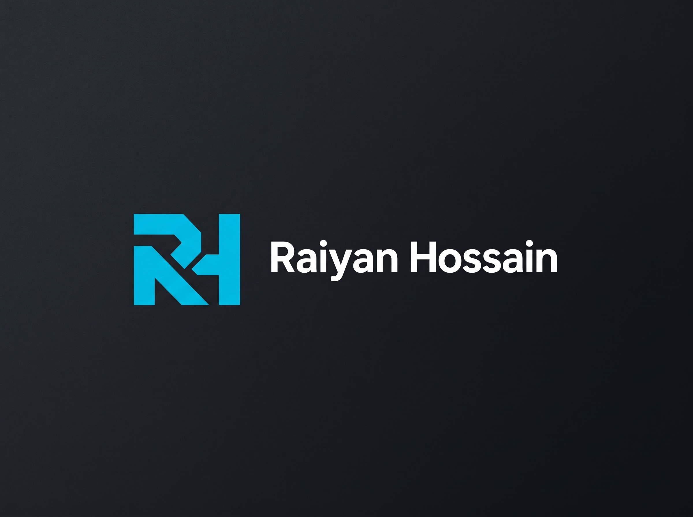
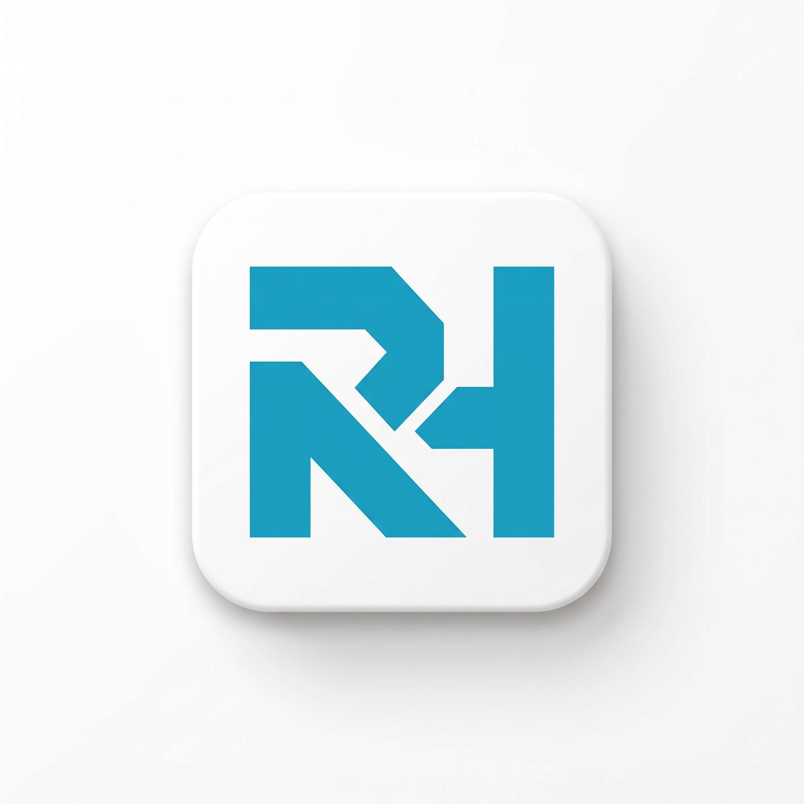
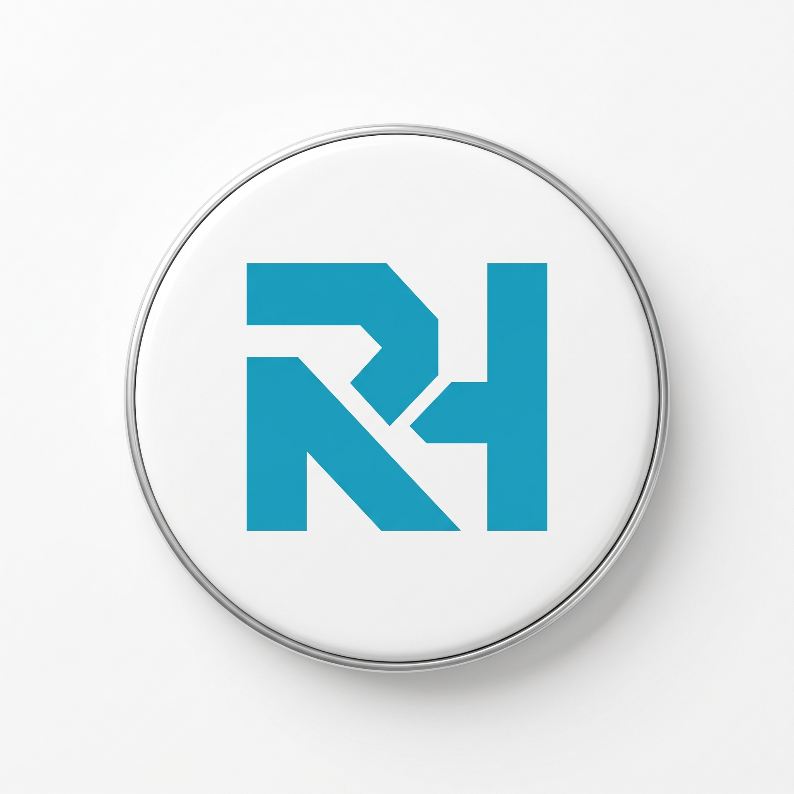

  

<h1 align="center">🚀 WELCOME TO MY UNIVERSE 🌌</h1>

  

  
  
  

  <a href="https://raiyanhossain.net"><b>🌐 Portfolio</b></a> &nbsp;•&nbsp;
  <a href="mailto:contact@raiyanhossain.net"><b>📫 Email</b></a> &nbsp;•&nbsp;
  <a href="https://github.com/RaiyanRafid?tab=repositories"><b>💻 Repositories</b></a> &nbsp;•&nbsp;
  <a href="https://facebook.com/raiyanhossainrafid"><b>💬 Connect</b></a>

  

## 🌍 About Me

  <picture>
    <source media="(prefers-color-scheme: dark)" srcset="assets/brand-dark.jpg">
    <source media="(prefers-color-scheme: light)" srcset="assets/brand-light.jpg">
    
  </picture>

- 🧠 **Software Engineer | Full-Stack & Cloud Architect**
- 🔥 Building **scalable**, **fault-tolerant**, and **high-performance** web architectures.
- 🛠 Passionate about **system automation, DevOps pipelines, and cloud infrastructure**.
- 💡 Exploring **Distributed Systems, Modern Web Engineering, and Cybersecurity**.
- 🌍 Open to **innovative collaborations** & **freelance consulting opportunities**.
- 📩 Reach me at: [Email](mailto:contact@raiyanhossain.net) | [Facebook](https://facebook.com/raiyanhossainrafid) | [Portfolio](https://raiyanhossain.net)

---

## ⚙️ Tech Stack & Tools

### 🚀 Languages & Frameworks

    

### 🛠 Backend & Databases

    

### ☁️ DevOps & Cloud

    

### 🛠 Tools & Platforms

    

---

## 📊 GitHub Stats & Activity

    
     
    
     
    

---

## 🎵 Now Playing on Spotify 🎧

    

---

## 🚀 Featured Projects

<table align="center" width="100%">
  <tr>
    <td align="center" width="50%" valign="top">
      
        
      <h3>🎵 Advanced Music Bot Suite</h3>
      
High-performance Discord bot featuring <b>Slash Commands</b>, advanced queue management, real-time audio filters & DSP processing.

    </td>
    <td align="center" width="50%" valign="top">
      
        
      <h3>🛠️ Pterodactyl & Cloud Systems</h3>
      
Robust server management architecture configured with <b>Nginx reverse proxy</b>, CloudPanel, Blueprint extensions, and scalable Docker deployments.

    </td>
  </tr>
</table>

---

## 💡 Fun Fact
🛠 I love **automating workflows** & **building modern, robust tech solutions**!

---

## 🌎 Connect With Me

    
    
    
    

---

  ⭐ <b>Star my repositories & follow me for more tech innovations!</b> 🚀🔥

