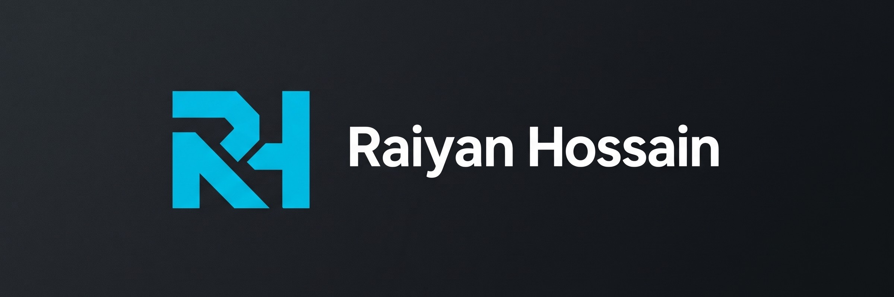
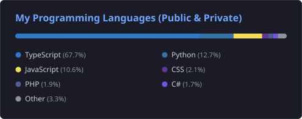
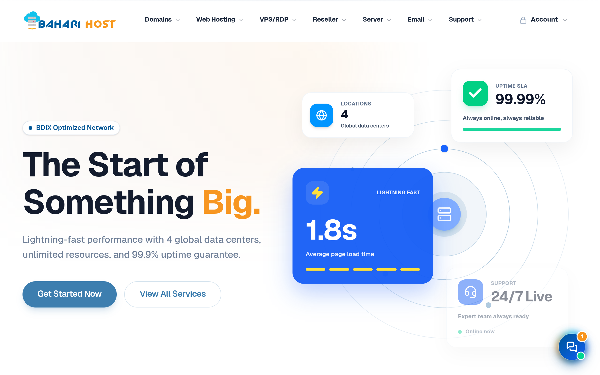
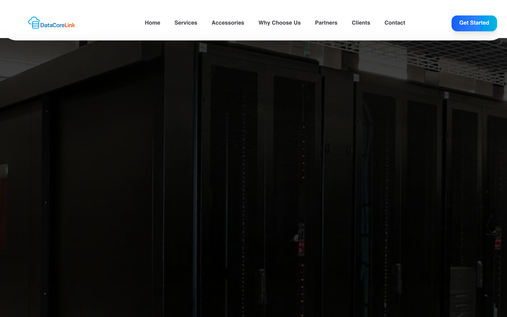
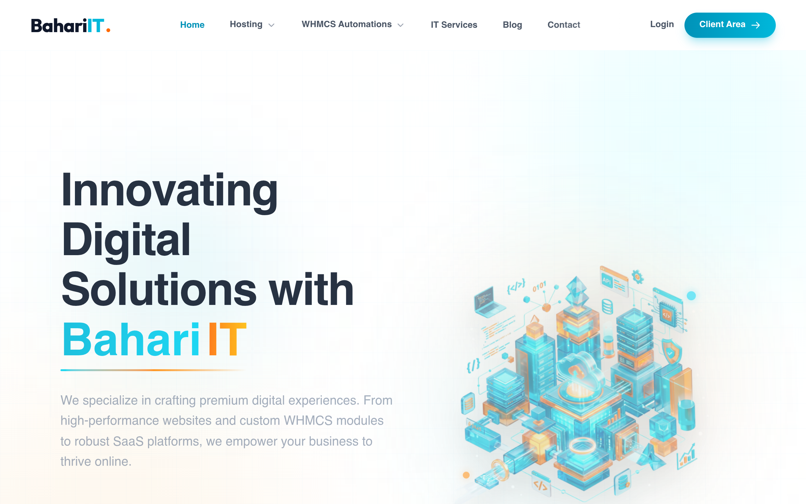
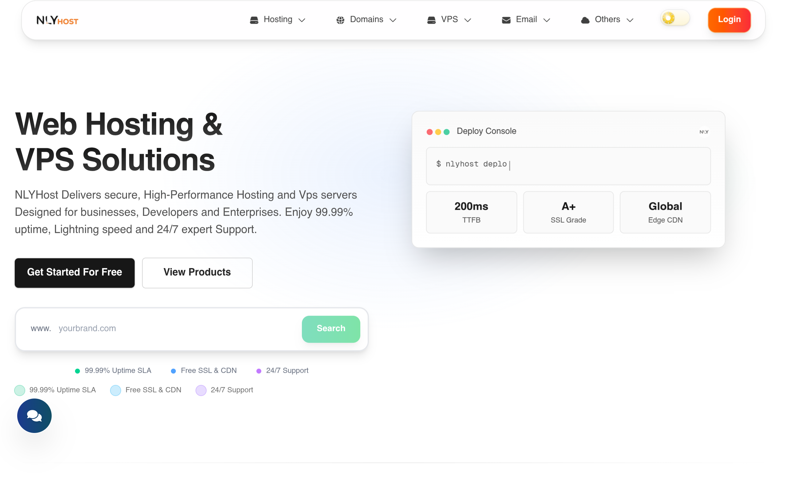
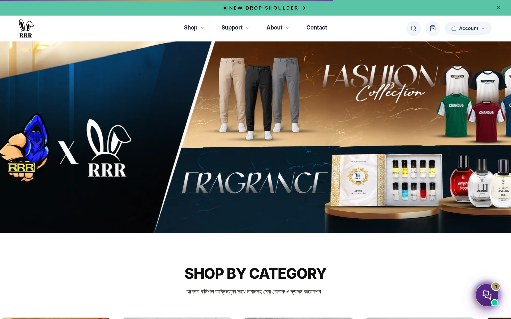

  

<h1 align="center">🚀 WELCOME TO MY UNIVERSE 🌌</h1>

  

  
  
  

  <a href="https://raiyanhossain.com"><b>🌐 Portfolio</b></a> &nbsp;•&nbsp;
  <a href="mailto:contact@raiyanhossain.com.bd"><b>📫 Email</b></a> &nbsp;•&nbsp;
  <a href="https://github.com/RaiyanRafid?tab=repositories"><b>💻 Repositories</b></a> &nbsp;•&nbsp;
  <a href="https://facebook.com/raiyanhossainrafid"><b>💬 Connect</b></a>

  

## 🌍 About Me

  <picture>
    <source media="(prefers-color-scheme: dark)" srcset="assets/hero-banner.jpg">
    <source media="(prefers-color-scheme: light)" srcset="assets/hero-banner-light.jpg">
    
  </picture>

  
  
  

> 🚀 **Hi, I'm Raiyan Hossain** — a Full-Stack Developer & Cloud Architect focused on engineering resilient distributed applications, high-performance web systems, and automated cloud workflows.

- 💻 **Full-Stack Engineering:** Architecting scalable modern web apps from frontend (**React, Next.js, TypeScript**) to robust backend services (**Node.js, Express, NestJS, Python, FastAPI**).
- ☁️ **Cloud Infrastructure & DevOps:** Deploying and orchestrating high-availability containerized microservices across **AWS, Docker, Kubernetes, CloudPanel, and Nginx**.
- ⚡ **Databases & High-Performance:** Designing optimized data schemas and caching layers with **PostgreSQL, MongoDB, Redis, and MySQL**.
- 🛠️ **Automation & Systems:** Building workflow automations, custom server management setups (Pterodactyl / Blueprint), and feature-rich Discord bot systems.
- 🤝 **Collaboration & Opportunities:** Open to high-impact software projects, freelance consulting, and technical collaborations.

  
  
  

---

## 🛠️ Technical Arsenal & Core Stack

  
  
  

<table align="center" width="100%">
  <tr>
    <td width="50%" valign="top">
      <h4>🌐 Frontend & UI Engineering</h4>
      

        
      

      <b>Core:</b> React 19 • Next.js App Router • TypeScript • TailwindCSS • Responsive UI Architecture
    </td>
    <td width="50%" valign="top">
      <h4>⚙️ Backend & API Architecture</h4>
      

        
      

      <b>Core:</b> RESTful & GraphQL APIs • Microservices • NestJS • Python FastAPI • High Throughput
    </td>
  </tr>
  <tr>
    <td width="50%" valign="top">
      <h4>☁️ Cloud, DevOps & Containers</h4>
      

        
      

      <b>Core:</b> Dockerization • Kubernetes • Nginx Reverse Proxy • Cloudflare Edge • CI/CD Automation
    </td>
    <td width="50%" valign="top">
      <h4>🗄️ Databases & Storage</h4>
      

        
      

      <b>Core:</b> Relational & Document DBs • Redis In-Memory Caching • Indexing & Optimization
    </td>
  </tr>
  <tr>
    <td colspan="2" align="center" valign="top">
      <h4>🛠️ Developer Tooling, Platforms & Workflows</h4>
      

        
      

      <b>Core:</b> Git Version Control • Postman API Suite • Figma UI/UX • Shell Scripting • Linux Server Administration
    </td>
  </tr>
</table>

---

## 📊 GitHub Analytics & Activity

  
  
  

  

  
  

  

---

## 🎵 Recently Played on Spotify 🎧

  

---

## 🚀 Featured Projects

  <b>A showcase of live production platforms, cloud infrastructure, enterprise solutions, and e-commerce brands I have built and engineered:</b>

<table align="center" width="100%">
  <tr>
    <td align="center" width="50%" valign="top">
      
        
      <h3>🌐 BahariHost — Cloud & NVMe Hosting</h3>
      

        
        
        
        
      

      

        High-performance web hosting & cloud infrastructure provider in Bangladesh. Engineered with ultra-fast NVMe storage, LiteSpeed Enterprise web servers, automated cPanel provisioning, high-frequency Cloud VPS, and low-latency BDIX connectivity with 24/7 technical support.
      

      

        
      

    </td>
    <td align="center" width="50%" valign="top">
      
        
      <h3>🏢 DataCoreLink — Enterprise Data Centre</h3>
      

        
        
        
        
      

      

        Mission-critical enterprise data center and colocation facility located in Dhaka, Bangladesh. Offering carrier-neutral Tier-III colocation, high-availability dedicated bare-metal servers, redundant N+1 power & precision cooling, and round-the-clock on-site network operations.
      

      

        
      

    </td>
  </tr>
  <tr>
    <td align="center" width="50%" valign="top">
      
        
      <h3>💻 Bahari IT — Digital Agency & Custom Solutions</h3>
      

        
        
        
        
      

      

        Full-stack digital agency and development house delivering custom WHMCS payment and provisioning modules, bespoke web application development, payment gateway integrations, automated server configurations, and enterprise business scaling.
      

      

        
      

    </td>
    <td align="center" width="50%" valign="top">
      
        
      <h3>⚡ NLYHost — Next-Gen Cloud Platform</h3>
      

        
        
        
        
      

      

        Developer-first cloud hosting platform featuring high-throughput NVMe SSD architecture, Anycast multi-terabit DDoS edge protection, automated instant domain provisioning, and an intuitive modern interface engineered for developers and businesses.
      

      

        
      

    </td>
  </tr>
  <tr>
    <td colspan="2" align="center" width="100%" valign="top">
      
        
      <h3>👕 RRR BRAND — Premier Fashion & Lifestyle E-Commerce</h3>
      

        
        
        
        
      

      

        The official e-commerce storefront for <b>Mr Triple R Official</b> (<code>mrtriplerofficial.com</code>), showcasing an exclusive line of streetwear drops, premium drop-shoulder t-shirts, handcrafted royal panjabis, luxury attar fragrances, and bespoke lifestyle merchandise with instant checkout.
      

      

        
      

    </td>
  </tr>
</table>

---

## 💡 Fun Fact
🛠 I love **automating workflows** & **building modern, robust tech solutions**!

---

## 🌎 Connect With Me

    
    
    
    

---

  ⭐ <b>Star my repositories & follow me for more tech innovations!</b> 🚀🔥

